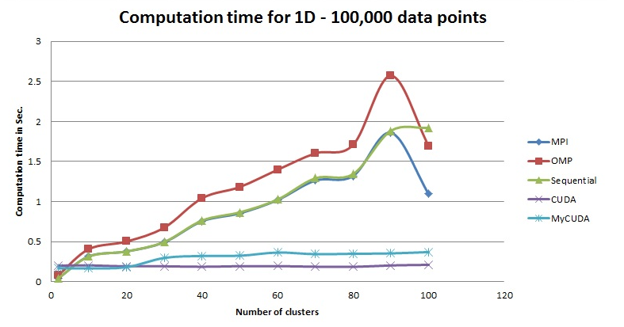
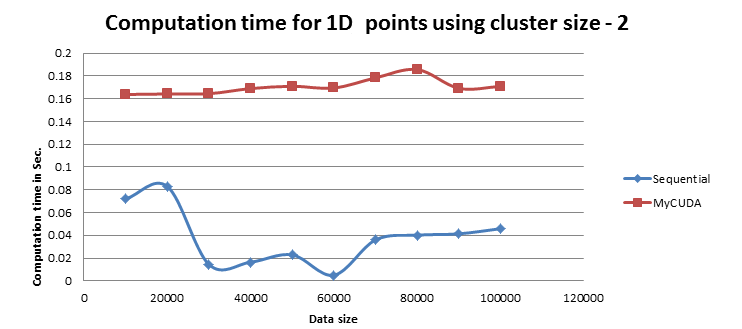

# CUDA K-Means Clustering

GPU-accelerated k-means clustering in CUDA C — three hand-written kernels, manually
packed shared memory, and a two-stage reduction, for datasets of arbitrary
dimensionality.


*99,968 points transposed for coalesced access, tiled across 781 thread blocks, and
reduced by three kernels per iteration. The grid shades each block by how many of its
points changed cluster, stepping through iterations 1, 3, 8 and 31 — watch it go quiet
as the algorithm converges. Every value in the diagram is generated from an actual run
(`tools/make-pipeline-svg.mjs`), not drawn by hand.*

**▶ [Try the interactive version](https://danielberhane.github.io/cuda-kmeans/)** — runs the
real algorithm on the real dataset in your browser. Change K, threads per block or the
convergence threshold and the whole trace recomputes; step or scrub through iterations and
watch the grid go quiet.

---

## Results

Benchmarked on 1D data, 100,000 points, against the four reference implementations in
the Northwestern parallel k-means package (Wei-keng Liao / Serban Giuroiu) — MPI,
OpenMP, sequential, and its own CUDA version. Those four are third-party code;
`MyCUDA` is this repository.



| K   | Sequential | OpenMP  | MPI     | **MyCUDA** | CUDA (ref) |
|-----|-----------|---------|---------|------------|------------|
| 2   | ~0.06 s   | ~0.10 s | ~0.10 s | **~0.16 s** | ~0.19 s   |
| 20  | ~0.39 s   | ~0.51 s | ~0.19 s | **~0.19 s** | ~0.19 s   |
| 50  | ~1.02 s   | ~1.17 s | ~1.20 s | **~0.33 s** | ~0.19 s   |
| 80  | ~1.33 s   | ~1.70 s | ~1.30 s | **~0.35 s** | ~0.19 s   |
| 100 | ~1.93 s   | ~1.70 s | ~1.10 s | **~0.37 s** | ~0.22 s   |

At K=100 this implementation is roughly **5× faster than the sequential baseline**.
The more meaningful result is the shape of the curve: both GPU implementations stay
essentially flat as K grows, while every CPU implementation climbs roughly linearly.
Adding clusters costs the GPU almost nothing until the work no longer fits.

### Where it loses

The same code is **4–10× slower than the CPU** at K=2:



| N       | Sequential | MyCUDA   |
|---------|-----------|----------|
| 10,000  | ~0.072 s  | ~0.165 s |
| 30,000  | ~0.013 s  | ~0.165 s |
| 60,000  | ~0.005 s  | ~0.170 s |
| 100,000 | ~0.046 s  | ~0.172 s |

The GPU time is *flat at ~0.17 s* whether it is given 10,000 points or 100,000. Cost
that does not respond to input size is not computation — it is fixed overhead: CUDA
context creation, host↔device transfers, and three kernel launches plus a blocking
device-to-host copy on every iteration. At K=2 there is not enough arithmetic to
amortise any of it.

This is the honest boundary of the approach. The GPU wins when there is enough work
per iteration to hide the transfer cost, and loses when there isn't.

### Effective bandwidth per kernel

Measured at n=100,000, k=100, d=1, block size 128:

| Kernel | Read | Written | Time | Effective BW |
|--------|------|---------|------|--------------|
| 1. `find_nearest_cluster`    | 801,400 B | 1,024,800 B | 0.24 ms | 6 GB/s ⚠️ |
| 2. `reduce_coord_clusters`   | 627,000 B | 800 B       | 0.18 ms | 3.48 GB/s |
| 3. `reduce_cluster_changed`  | 3,124 B   | 6,248 B     | 0.12 ms | 0.078 GB/s |

Kernel 3 is the bottleneck, and the numbers say why: it consumes **22% of the
per-iteration kernel time to move 0.5% of the bytes**. It launches as
`<<<1, numReductionThreads>>>` — a single thread block — so one SM works while every
other one on the device sits idle. Parallelising that reduction across blocks is the
clearest available improvement.

> ⚠️ Kernel 1's stated 6 GB/s does not follow from its own inputs, which give
> 7.61 GB/s. Kernels 2 and 3 both reproduce exactly. Treat the kernel 1 figure as
> unverified pending a re-run — see [`presentation/BENCHMARKS.md`](presentation/BENCHMARKS.md).

---

## How it works

K-means partitions N points into K clusters by repeatedly assigning each point to its
nearest centroid, then moving each centroid to the mean of its members, until fewer
than `threshold` of the points change cluster.

Both steps are parallelised across three kernels, launched in this order every
iteration:

**1. `find_nearest_cluster`** — one thread per point. Computes the nearest centroid and
accumulates per-block coordinate sums in shared memory, so each block emits a partial
result rather than contending on global memory.

**2. `reduce_cluster_changed`** — counts how many points changed cluster this iteration,
to test convergence.

**3. `reduce_coord_clusters`** — reduces the per-block partial sums across all blocks
into the global coordinate sums and per-cluster counts.

The host transposes the data from `[N][D]` to `[D][N]` **once**, before upload. That
turns each warp's reads of a coordinate into a contiguous, coalesced access instead of
a strided one — the single most important layout decision in the implementation.

Centroid division and the convergence test happen on the host, so each iteration
includes blocking device-to-host copies. Note where the first one falls: δ is copied
back **between the second and third kernels**, so the host stall interrupts the
pipeline rather than following it. That serialisation is what the K=2 results above
are measuring.

### Launch geometry

For `data/points_3d.txt` (99,968 points, D=3) at K=4:

```
grid              781 blocks × 128 threads      ceil(99968 / 128)
reduction kernel  1 block × 1024 threads        nextPowerOfTwo(781)
shared memory     1,904 bytes per block
iterations        31                            threshold = 0.001
```

Shared memory is packed by hand into six regions from a single `extern __shared__`
allocation:

| Region | Purpose | Bytes |
|--------|---------|-------|
| `s_objects`        | the block's tile of points     | 1,536 |
| `s_clusters`       | all centroids                  | 48 |
| `s_sum_clusters`   | per-cluster membership counts  | 16 |
| `s_sum_coords`     | per-cluster coordinate sums    | 48 |
| `s_memb_changed`   | per-thread changed flags       | 128 |
| `s_membership`     | per-thread assignment          | 128 |
| | **total** | **1,904** |

---

## Build

Requires the NVIDIA CUDA Toolkit and a CUDA-capable GPU.

```bash
make                      # the main executable
make cuda_kmeans_bench    # instrumented build, per-kernel timings
make bench-tools          # CPU baseline + data generator (no CUDA needed)
make clean
```

`GENCODE` is empty by default, so `make` works anywhere — including a login node with
no GPU — but nvcc then targets its own default and relies on PTX JIT. Name the
architecture for anything you intend to benchmark:

```bash
make GENCODE="-arch=sm_80"     # A100
make GENCODE="-arch=sm_70"     # V100
make GENCODE="-arch=native"    # match this machine's GPU (needs a GPU present)
```

## Usage

```bash
./cuda_kmeans <num_clusters> <num_dimensions> <num_points> <threshold> <input_file> [--csv]
```

```bash
./cuda_kmeans 4 3 99968 0.001 data/points_3d.txt
./cuda_kmeans 4 10 99968 0.001 data/points_10d.txt
```

**Input** — one point per line; the first column is an id and is ignored, the rest are
coordinates:

```
1 61.015527 20.459306 32.295319
2 63.265007 76.450910 14.535881
```

**Output** — two files next to the input: `<input>.cluster_centres` and
`<input>.membership`. `--csv` emits a single machine-readable row instead and skips
writing them, for benchmark sweeps.

Note that the bundled datasets contain **no cluster structure**. They exist to measure
throughput, not clustering quality; k-means on them produces a Voronoi partition of the
space rather than recovered structure.

They are also not quite uniform. In `points_3d.txt`, dimensions 2 and 3 hold 99,968
distinct values as expected, but dimension 1 draws from only **19,968** — the same value
pool as `points_1d.txt` — and 288 of those values account for roughly 80% of all points,
repeating between 191 and 418 times each. The
[interactive demo](https://danielberhane.github.io/cuda-kmeans/) renders this as visible
vertical banding.

This does not affect the timing results, which perform identical arithmetic either way,
but it does mean the data should not be described as uniformly random.

## Re-running the benchmarks

```bash
make bench-tools
sbatch bench/run_bench.slurm      # edit the SBATCH placeholders first
```

The harness sweeps dimensionality × K across the bundled datasets plus an N-scaling
series, takes the fastest of three runs, and **gates on the CPU and GPU builds
converging in the same number of iterations** — if they diverge they are not doing the
same work, and any speedup computed from them is meaningless.

The diagram at the top is regenerated the same way, from the same algorithm:

```bash
node tools/verify-trace.mjs        # gate: 781 blocks, 1,904 B, 31 iterations, δ sequence
node tools/make-pipeline-svg.mjs   # -> assets/pipeline.svg
```

`tools/verify-trace.mjs` exists so the diagram cannot drift into fiction. It asserts
the engine reproduces every value measured from the real code — grid geometry, the
shared-memory layout region by region, the iteration count, and the full δ sequence to
five decimals — and checks that per-block counts sum to the global count on every
iteration. If it fails, nothing generated from that engine should be published.

`bench/seq_kmeans.c` is the CPU baseline. It matches this implementation exactly
(first-K initialisation, squared float distance without `sqrt`, `delta = changed/N`
convergence, 500-iteration cap) and is built at `-O3` with an optional OpenMP path, so
the comparison is not against a strawman.

## Project structure

```
├── src/
│   ├── cuda_kmeans.cu    # the three kernels and the host convergence loop
│   ├── cuda_main.cu      # driver
│   ├── cuda_io.cu        # file I/O
│   ├── cuda_wtime.cu     # wall-clock timer
│   └── kmeans.h          # shared header, perf struct, utility macros
├── bench/
│   ├── seq_kmeans.c      # semantics-matched CPU baseline
│   ├── gen_points.c      # deterministic generator for scaling studies
│   └── run_bench.slurm   # benchmark sweep
├── docs/                 # the interactive demo (GitHub Pages)
│   ├── engine.js         # the algorithm, shared with the tools below
│   ├── worker.js         # traces run off the main thread
│   └── app.js            # canvas rendering and controls
├── tools/
│   ├── kmeans-engine.mjs      # Node wrapper over docs/engine.js
│   ├── verify-trace.mjs       # asserts it matches the measured values
│   ├── make-pipeline-svg.mjs  # generates the diagram above from a real run
│   └── make-demo-data.mjs     # packs the dataset for the browser
├── assets/pipeline.svg   # the animated execution-model diagram
├── data/                 # 99,968 points at 1, 3 and 10 dimensions
├── presentation/
│   ├── k-means-cuda-2015.pptx
│   ├── BENCHMARKS.md              # figures above, transcribed with caveats
│   ├── kernel-design-notes.txt    # original 2015 kernel design note
│   └── figures/
├── Makefile
└── LICENSE
```

## Provenance

Written in 2015 as a graduate project in the Department of Electrical and Computer
Engineering at George Mason University, and run on GMU's Hopper HPC cluster. The
benchmark figures above are from the original presentation; the hardware they were
measured on was not recorded, which is one of several gaps
[`bench/run_bench.slurm`](bench/run_bench.slurm) is designed to close on a re-run.

## Acknowledgments

The I/O utilities (`cuda_io.cu`, `cuda_wtime.cu`), header (`kmeans.h`) and original
Makefile structure are based on code by **Wei-keng Liao** (Northwestern University)
and **Serban Giuroiu**, released under the MIT License.

The MPI, OpenMP, sequential and reference-CUDA implementations used as comparison
baselines in the charts above are from that same package. They are not vendored here —
only the measurements taken against them are reproduced.

The CUDA kernels in `src/cuda_kmeans.cu`, the host driver, and the benchmark harness
in `bench/` were written by **Daniel Berhane Araya**.
[`presentation/kernel-design-notes.txt`](presentation/kernel-design-notes.txt) is the
original 2015 design note describing each kernel's inputs, outputs and shared-memory
layout.

## License

MIT. See [LICENSE](LICENSE).
